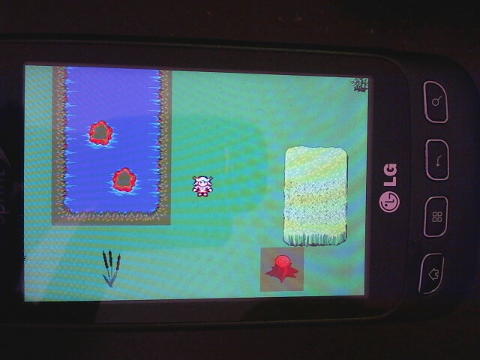

json_loader
===========

Overview
--------
Example python json map loader for Tiled maps saved in json format.  The graphics and mouse io are handled by Pygame.
The application is loaded onto Android phones with Pygame Subset for Android (pgs4a).
This also handles the mapping of the mouse to the touchscreen.  pgs4a only
handles single-point touch.   You won't be able to do things like two finger swipe
or rotate that requires two finger touch.

Click on the link below to see a video of the lesson's example code.

* [Running on a Samsung Android phone](http://youtu.be/tJ_O48oTpxk)

The example was developed as part of the teaching curriculum for my 14 year old son.

I originally created a video for him to learn how to use Tiled.  When I put it up on YouTube, several people commented on it and wanted the code for the example.  I decided to put the code up so that I could share it with people that watched the video.  This is the second version of the JSON loader code.

In order to progress in our lesson and get some 2D game development experience, I have my son working on a JSON loader.  The lessons seem to be working so far.

Usage
-----

To use this lesson, you will need:

* Python
* [Pygame](http://www.pygame.org/)
* [Pygame Subset for Android](http://pygame.renpy.org/)
* [Tiled](http://www.mapeditor.org/)

First, play around with the example program.  Have fun and understand the goal.
Execute the sample program on your desktop with:

    $ python main.py

Next, create your own maps with Tiled and play around with the loader.
Show your friends, write your own game, extend the loader.
Put the game on your Android  phone.  When you are ready, start building
the JSON loader on your own using the steps listed below and this code
as a reference.

To edit the sample program:

The ./img directory contains graphics for two characters, a boy and and girl.
The girl is default.  To use the boy,

change the line below

    player_image_file = "img/girl.png"

to

    player_filename = "img/boy.png"

Set TESTING to False to turn off red colored squares over collision
objects.

In main.py change the map file:

    map_file ="maps/NAME_OF_YOUR_MAP_FILE.json"

Your map file must be in JSON format.  You must set the properties
of the collision layer in your map file to "1".   All your tilesets must
be in maps/tilesets.  I created a YouTube video on how to use
Tiled to create the proper JSON map file.  See the YouTube channel
if you need help.

map.move(-200, 0) sets the initial position of the player
when the game starts.  If you set this to [0, 0], the player will be
in the upper left-hand quadrant of your map.  Use negative values to
start the player to the right on the map or down on the map.

Who This is For
---------------
This lesson is part of a teaching curriculum for a 14 year old boy,
my son.  He started learning Python at age 12 at an average of 1 lesson
per month, more in the summer and less during soccer season.  Initially,
each lesson lasted 30 to 60 minutes, less when he was 12 and more
as he got older.  The teaching method was developed after unsuccessfully
trying curriculum developed for adults. Typical books for adults focus
too much on theory.  I was also not satisfied with courses based on Scratch
or Alice.  I wanted my son to start learning more about data structures,
parsing data, and mobile application development.

My method is based on repetitive drills.  If you're a parent interested
in my teaching methodology, you should watch my presentation on YouTube:

* [How to Teach Your Teenager Computer Programming](https://www.youtube.com/watch?v=re2oDDaNbTM)

If you are a teenager interested in learning to program mobile
applications on your Android phone, you should follow the process
outlined on my YouTube channel

* [PyChildren YouTube Channel](https://www.youtube.com/user/surfkidsdad)

The process is:

1. The Blank Screen

2. The Stationary Square

3. The Moving Square

4. Touchscreen movement

5. Going Mobile - Getting your app on your Android phone

    - Adding Android-specific code
    - Configuring pgs4a
    - Loading the app onto your phone with a USB cable

6. Putting it all together - Adding graphics and a virtual controller

7. 2D ground scroller basic

8. Pygame character animation

9. 2D Tile map basic.  No loader.  Map doesn't scroll (see Swarm game)

10. Tiled 2D tile map creation in JSON format

11. Building the json loader to get the map onto the phone

Except for Swarm, there are video tutorials for all the lesson blocks.
Each of the eleven lesson blocks above is more than one day of lessons.
Assuming one class per week, the JSON loader lesson could take months
to complete.

Steps to build a 2D tile map loader
---------------------------------
1. Mapfile

    Example: class Initialize

    1.1 read json map file from disk

    1.2 load into python dictionary

2. Tilesets

    Example: class Intialize.tileset()

    2.1 extract list of tilesets from map dictionary

    2.2 for each tileset, slice a 32x32 pixel square

    2.3 load each tile into a dictionary of all tiles from all the tilesets

3. Display Tiles

    Example: Initialize.build()

4. Display Player

    Example: class Player

5. Check for touchscreen input and set direction (or keyboard on desktop computer)

    Example: class Event()

    5.1 Keyboard input using arrow keys

    5.2 touchscreen input

        - create virtual game controller

        Example: class GameController()

        - check for touchscreen input with virtual game controller

        Example: Event.mouse_direction()

6. Move Tiles

    Example: class Map.update(direction) and class Map.move(x = 0, y = 0)

7. Check boundaries

    Example: Map.clear_to_move()

8. Handle collision

    Example: Layer.check_collision()

Screenshots of Game on Android Phone
------------------------------------

Future
------
There's a scroller example and some ideas of what you can do with this in the future.

* [Look in doc/](doc/future.md)
